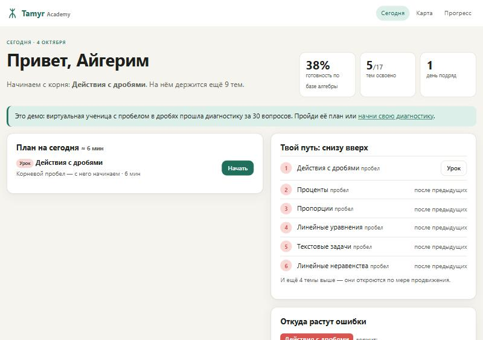
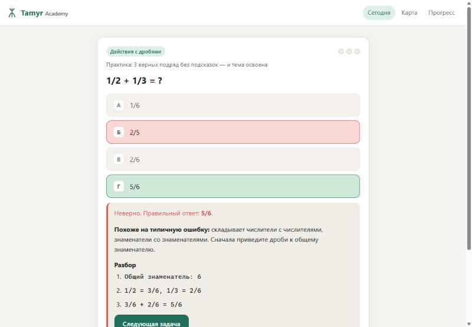
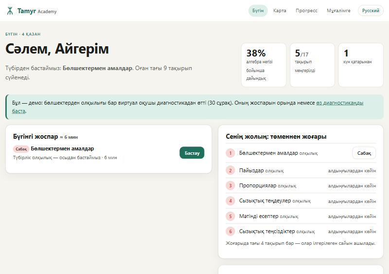
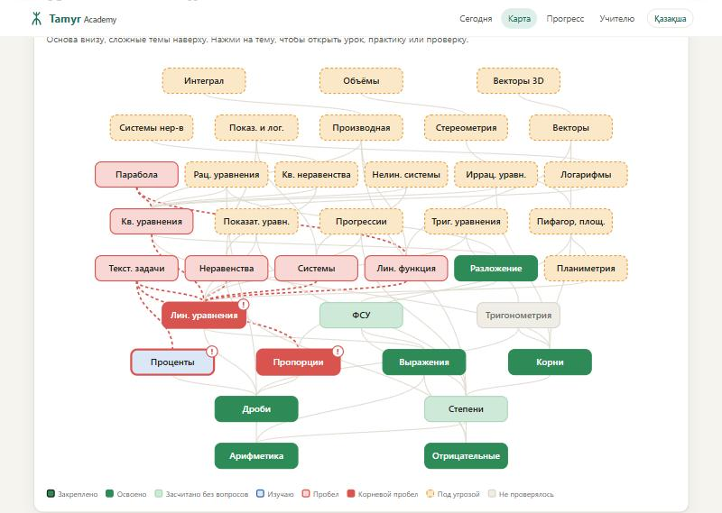

# Tamyr — находит корень пробелов в знаниях

**VentureHack 2026 · Трек 2 — EduTech и образование будущего**
Направления трека: персонализированное и адаптивное обучение · оценивание знаний и обратная связь · образовательная аналитика · инструменты для учителей.

> Ученик ошибается в квадратных уравнениях, а причина — в дробях, которые «прошли» в 6 классе.
> Обычный тест покажет «62%, тема: квадратные уравнения». Tamyr покажет **«корень — действия с дробями»** и план, с чего начать.

*Тамыр* (каз.) — корень.

**Команда:** Bolatbay Yersultan · Zharkynuly Eren · Kydyrkhan Olzhas
**Репозиторий:** https://github.com/sas1k00/hackathonchik
**Демо:** https://sas1k00.github.io/hackathonchik/ *(включите GitHub Pages: Settings → Pages → Deploy from branch → main / root)*

---

## От диагностики к обучению

Хакатонная версия (коммит `ec80db7`) ставила диагноз и на этом заканчивалась. Поверх того же движка добавлено обучение — цикл «диагноз → урок → практика → закрепление»:

| Этап | Что происходит |
|---|---|
| **Диагноз** | Движок без изменений. Новое: диагностику можно остановить в любой момент или пропустить — темы допроверяются по ходу. |
| **План на сегодня** | Приложение само решает, что делать: повторения → проверка основы → урок по корню → практика → следующая непроверенная тема. |
| **Урок** | Правило, разбор примера по шагам, ловушки — в первую очередь ошибки, которые ученик сам сделал в диагностике. |
| **Практика** | Лестница подсказок (правило → первый шаг → решение). После ошибки — объяснение именно этой ошибки и пошаговый разбор. Освоение: 3 верных подряд без подсказок. |
| **Непрерывная диагностика** | Ошибка «чужой» темы в практике ставит ту тему на проверку в тот же день. |
| **Закрепление** | Освоенная тема возвращается через 1 день, затем 3, 9, 27. Провал повторения возвращает её в работу. |

Добавлено: урок и пошаговые решения для каждой темы и каждого вопроса, генераторы бесконечной практики для 6 базовых тем, модель ученика (`js/learner.js`) и тесты к новому слою (`tests-academy.html`). Панель учителя работает как раньше: ученик копирует код на странице «Прогресс».




### Қазақ тілі / казахский язык

Интерфейс и весь учебный контент доступны на двух языках — переключатель в шапке, выбор запоминается на устройстве. По-казахски есть всё то же, что по-русски: 36 тем, 86 ошибок мышления, 216 вопросов с вариантами, 36 уроков, 216 пошаговых решений, генераторы задач и панель учителя.

Как устроено: русский текст в коде — исходный и служит ключом; перевод лежит в двух файлах — `js/kk.js` и `js/kk-ent.js`, чтобы носитель языка мог вычитать его, не читая код. `tests-academy.html?lang=kk` проверяет, что переведена каждая строка интерфейса, каждый вопрос и вариант, что в переводе сохранились все числа и что каждое решение приходит к верному ответу.



**Чего здесь нет:** уроки и решения написаны с помощью ИИ и не проверены учителем; **казахский перевод тоже сделан ИИ и не вычитан учителем, который преподаёт математику на казахском**; пороги (3 подряд, интервалы 1-3-9-27) не подобраны по данным; «готовность» — доля графа, а не прогноз балла; реальные ученики приложение ещё не проходили.

---

## Проблема

**Базовая математика — массовая проблема в Казахстане:**
- В PISA 2022 только **50%** 15-летних школьников Казахстана достигли минимального уровня по математике (уровень 2+). Средний показатель по ОЭСР — 69%. Высокий уровень (5–6) у 2% против 9% по ОЭСР. [¹](#источники)
- ЕНТ-2025: **216 тыс. абитуриентов**, средний балл **64 из 140**. [²](#источники) «Математическая грамотность» обязательна для всех поступающих на нетворческие специальности. [³](#источники)

**Почему не помогает обычная подготовка:**
- Школьная математика кумулятивна: каждая тема держится на предыдущих, и пробел в базовой теме всплывает позже, в теме, которая на ней держится. На этом построены модели «пространств знаний» (Doignon & Falmagne, 1985) и системы вроде ALEKS. [⁴](#источники)
- Пробники ЕНТ дают **балл по теме, где произошла ошибка**, но не говорят, **почему** ученик ошибся. Ученик и репетитор повторяют «квадратные уравнения», хотя чинить нужно дроби или правило знаков.
- У учителя 25–30 учеников в классе. Провести индивидуальную диагностику каждого по всем темам с 5 по 9 класс он физически не может.

**Целевая аудитория:** ученики 9–11 классов, которые готовятся к ЕНТ, их учителя математики и репетиторские центры.

**Это подтверждают и практикующие преподаватели.** Мы опросили 4 человек (учитель математики, репетитор, преподаватель учебного центра, учитель физики) — все независимо, своими словами, описали ровно этот паттерн:

> «Ученик не может нормально решать квадратные уравнения, но проблема оказывается не в квадратных уравнениях, а в действиях с отрицательными числами, дробями или раскрытии скобок. Это материал намного более ранних классов.»
> — учитель математики, школа

Полные ответы и ещё 3 интервью — в `docs/validation-plan.md`.

## Решение

Веб-приложение из трёх частей:

1. **Адаптивная диагностика.** Начинает с целевой (сложной) темы и при ошибке спускается по графу пререквизитов к базовым темам. Если ученик уверенно решил тему, всё, на чём она держится, засчитывается без вопросов. Ученику без пробелов хватает около 10 вопросов.
2. **Карта знаний и план «снизу вверх».** Показывает корневые пробелы, цепочки «ошибка в X → корень в Y», ошибки мышления, найденные по выбранным неверным ответам, и план: правило, пример, разбор *своей* ошибки и 2 новые проверочные задачи.
3. **Панель учителя.** Корневые пробелы класса, самые частые ошибки мышления, готовые мини-группы для 15-минутного разбора, тепловая карта «ученик × тема», выгрузка в CSV.

Приложение устанавливается на телефон (PWA) и после первого открытия работает **без интернета**.

## Что внутри

| Компонент | Содержание |
|---|---|
| Граф знаний | 36 тем на 9 уровнях: от «Порядка действий» до интеграла, стереометрии и векторов в пространстве; 60 рёбер-пререквизитов |
| Банк заданий | 216 вопросов в формате ЕНТ (6 на тему), у каждого — пошаговое решение. 287 из 648 неверных вариантов помечены конкретной ошибкой мышления. Практика начинается с заданий, которых ученик не видел в диагностике |
| Ошибки мышления | 86 типичных ошибок (например, «складывает числители с числителями, знаменатели со знаменателями»). У каждой есть «домашняя» тема и правило исправления |
| Уроки | 36 уроков: правило, разбор примера по шагам, вывод |
| Движок | `js/engine.js`: адаптивный поиск по графу, правило «перевес в 2 ответа», маршрутизация по меткам ошибок |
| Хранение | Результаты хранятся на устройстве (`localStorage`). Ученик передаёт результат учителю **кодом** с именем и статусами тем. Код проверяется: неизвестные темы и ошибки отбрасываются. Сервер и сбор персональных данных не нужны |
| Офлайн | `manifest.webmanifest` + `sw.js`: установка на телефон, работа без сети |

Первые 17 тем (алгебра 5–9 классов) — из хакатонной версии, лежат в `js/data.js`. Остальные 19 добавлены позже и лежат в `js/data-ent.js`; они дописаны в конец списка, поэтому коды учеников из старой версии по-прежнему читаются.



### Соответствие спецификации ЕНТ

Официальная спецификация теста «Математика» для ЕНТ (с 2026 года, НЦТ) содержит 18 тем. [⁵](#источники) По каждой из них в графе есть хотя бы одна тема — но это **базовый уровень**: по 6 задач на тему, без чертежей, без заданий с несколькими ответами и на соответствие.

| Тема спецификации ЕНТ | Темы Tamyr | Чего нет |
|---|---|---|
| 01 Действия с радикалами; числовые, дробные и целые выражения | Порядок действий, Отрицательные числа, Дроби, Квадратный корень | — |
| 02 Действия со степенями | Степени | степени с дробным показателем |
| 03 Тригонометрия | Тригонометрия: значения и тождества | формулы сложения, двойного угла, приведения |
| 04 Алгебраические выражения, ФСУ, разложение многочлена | Выражения, ФСУ, Разложение на множители | алгебраические дроби |
| 05 Линейные, квадратные, дробно-рациональные уравнения | Линейные, Квадратные, Дробно-рациональные уравнения | — |
| 06 Тригонометрические и иррациональные уравнения | Тригонометрические уравнения, Иррациональные уравнения | уравнения, сводящиеся к квадратным |
| 07 Показательные и логарифмические уравнения | Показательные уравнения, Логарифмы и логарифмические уравнения | — |
| 08 Системы линейных и нелинейных уравнений | Системы уравнений, Системы нелинейных уравнений | — |
| 09 Системы тригонометрических, иррациональных, показательных, логарифмических уравнений | Показательные и логарифмические неравенства и системы | тригонометрические и иррациональные системы |
| 10 Линейные, квадратные, рациональные, тригонометрические, иррациональные, показательные и логарифмические неравенства | Линейные неравенства, Квадратные и рациональные неравенства, Показательные и логарифмические неравенства и системы | тригонометрические и иррациональные неравенства |
| 11 Системы неравенств | Системы неравенств | показательные и логарифмические системы неравенств |
| 12 Арифметическая и геометрическая прогрессии | Прогрессии | бесконечно убывающая прогрессия |
| 13 Начала анализа; математическое моделирование | Производная, Первообразная и интеграл, Текстовые задачи, Проценты, Пропорции, Линейная и квадратичная функции | производная сложной функции, пределы |
| 14 Планиметрия: фигуры и их взаимное расположение | Планиметрия: углы и фигуры | параллельные прямые, признаки равенства, задачи с чертежом |
| 15 Метрические соотношения; векторы и преобразования | Теорема Пифагора, площади, подобие; Векторы на плоскости | теоремы синусов и косинусов, преобразования плоскости |
| 16 Фигуры в пространстве | Фигуры в пространстве | сечения, взаимное расположение прямых и плоскостей |
| 17 Метрические соотношения в пространстве | Объёмы и площади поверхностей | углы и расстояния в пространстве |
| 18 Векторы и преобразования в пространстве | Векторы в пространстве | преобразования пространства |

Ответы новых задач проверены независимо от текста решений: `py tools/check_math.py` подставляет корни, перебирает неравенства по сетке и считает производные и интегралы численно.

## Как работает алгоритм

```
стек ← целевые темы
пока стек не пуст:
    тема ← вершина стека; задать вопрос по теме
    верных на 2 больше, чем неверных  → ОСВОЕНО   (В В; В Н В В; …)
        если без единой ошибки         → все пререквизиты «освоены (выведено)», вопросов по ним не будет
    неверных на 2 больше               → ПРОБЕЛ   (Н Н; В Н Н Н; …)
        → в стек: непроверенные пререквизиты темы
        → первыми в стек: «домашние» темы ошибок, выданных неверными вариантами
    банк темы (6 вопросов) исчерпан    → решает большинство, при ничьей — пробел
корневой пробел = тема-пробел, у которой нет пробелов среди пререквизитов
«под угрозой»   = непроверенные темы, опирающиеся на пробел
```

Решения в движке, которые можно обосновать:
- **Перевес в 2 ответа, а не «2 из 3».** При 4 вариантах угадывание даёт около 25%. Правило «2 из 3» засчитывало тему после Н-В-В, а перевес в 2 требует ещё одного подтверждения. На контрольной симуляции точность выросла с 72% до 85% (таблица ниже).
- **Освоение с ошибкой не распространяется на основы.** Иначе одна удачная догадка «закрывает» целую ветку графа.
- **Корень подтверждается ответами, а не выводом.** При пробеле проверяются даже те пререквизиты, которые раньше были выведены из другой темы.
- **«Не знаю» лучше угадывания.** Кнопка есть в каждом вопросе и считается неверным ответом без метки ошибки.

## Проверка алгоритма (симуляция)

`tests.html` содержит 23 юнит-теста (граф, банк заданий, правила движка, практика, защита кода ученика) и симуляцию виртуальных учеников с заранее известными корневыми пробелами. Это проверка алгоритма, а **не** данные реальных учеников.

Модель ученика: знает тему → отвечает верно с вероятностью 92%; не знает → угадывает в 20% случаев, иначе в 70% выбирает «типичную» ошибку. Эту модель составили мы сами, поэтому цифры ниже — оценка сверху, а не обещание.

Движок дорабатывался на наборе «настройка». Основные цифры посчитаны на **отдельном контрольном наборе**: 1000 новых учеников, которых при доработке не видели.

| Набор (цель «Основа алгебры», 17 тем) | Полнота (найдено настоящих корней) | Точность (найденные корни верны) | Карта совпала полностью | Вопросов: без пробелов / 1 корень / 2 корня |
|---|---|---|---|---|
| Прошлая версия («2 из 3»), контроль | 79,3% | 72,4% | 76,1% | 9,0 / 28,0 / 30,3 |
| Настройка (для сравнения) | 89,6% | 84,5% | 86,5% | 9,4 / 34,5 / 38,5 |
| **Контроль** | **89,6%** | **85,2%** | **86,8%** | **9,7 / 34,3 / 37,1** |
| Контроль: угадывание 25% | 83,0% | 78,1% | 80,9% | 9,7 / 34,8 / 37,1 |
| Контроль: 85% верно в знакомых темах | 86,8% | 73,5% | 73,6% | 11,7 / 36,1 / 39,5 |
| Контроль: без шума (проверка логики) | 100% | 100% | 100% | 8,0 / 27,4 / 30,2 |

Цифры контроля почти не отличаются от настройки, значит движок не подогнан под конкретный набор. Цена точности — длина: ученику с пробелом нужно около 34 вопросов (15–20 минут на полную диагностику). Цель «Квадратные уравнения» короче: около 2 вопросов без пробелов и около 19 с одним пробелом (контроль, 1000 учеников, карта совпала полностью в 86% случаев).

## Похожие решения и чем мы отличаемся

Идея «карты знаний» не новая, и мы этого не скрываем.

| Решение | Что делает | Чем отличается Tamyr |
|---|---|---|
| **ALEKS** (McGraw Hill) | Адаптивная оценка по теории пространств знаний, платная подписка, программы США | Программа и формат ЕНТ, бесплатно для ученика, работает офлайн без регистрации |
| **Eedi** (Великобритания) | Диагностические вопросы, в которых неверные варианты указывают на ошибку мышления | Та же идея меток ошибок, но мы добавляем спуск по графу к корню в младших классах и план «снизу вверх» |
| **Khan Academy** | Бесплатные курсы и система освоения по темам | Не курс, а короткая диагностика причины: с чего начать повторение |
| **Пробники ЕНТ** | Балл и разбор по темам, где произошла ошибка | Диагноз причины, а не только балл; учителю — корни класса и готовые группы |

Наше отличие — связка «неверный вариант → домашняя тема ошибки → проверка корня» под школьную программу Казахстана, в формате, который работает на любом телефоне без регистрации, с панелью учителя. *Перед защитой проверьте актуальные описания конкурентов на их сайтах.*

## Рынок, экономика и внедрение

**Аудитория (по открытым данным):**
- 216 тыс. абитуриентов ЕНТ в 2025 году. [²](#источники)
- Около 184 тыс. из них сдают обязательную «Математическую грамотность». Это *наша оценка*: 216 тыс. минус примерно 15% творческих специальностей. [²](#источники) [³](#источники)
- 72% сдают ЕНТ на казахском языке. [²](#источники) Поэтому казахская версия — первый пункт дорожной карты: без неё мы закрываем только около 28% рынка.

**Затраты сейчас:** хостинг на GitHub Pages — 0 ₸, сервера нет, данные хранятся у пользователя. Основная затрата — время учителей на проверку графа и банка заданий и перевод на казахский.

**Модель монетизации** — цены для B2C и учебных центров взяты из 4 интервью с преподавателями (не гипотеза, полные ответы в `docs/validation-plan.md`), школьная цена пока гипотеза:
- **B2C freemium:** диагностика бесплатна; платно — расширенные банки (геометрия, тригонометрия) и повторная диагностика.
- **Репетиторы:** 5 000–10 000 ₸/мес за инструмент, по словам опрошенного репетитора — «если он действительно экономит время на диагностике».
- **Учебные центры:** 30 000–70 000 ₸/мес за центр или 500–1 500 ₸/активного ученика/мес — обе модели назвал сам преподаватель учебного центра.
- **Школы (гипотеза):** бесплатно для учителя, чтобы получить охват; платные — аналитика по параллели и выгрузки.

**Почему это работает быстрее ручной диагностики** — из тех же интервью: учитель тратит 30–40 мин теста + 1–2 часа на класс, репетитор — минимум одно занятие (часто 2–3), учебный центр — тест 40–60 мин плюс неделю наблюдений. Tamyr — 10–34 вопроса, 10–20 минут на одного ученика.

**Масштабирование:** граф и банк — это данные, а не код. Новый раздел или предмет — это новый `data.js`, движок менять не нужно.

## Запуск

Сборка и зависимости не нужны: это чистые HTML/CSS/JS.

- Откройте `index.html` двойным кликом, **или**
- `python -m http.server 8000` → http://localhost:8000 (так работает и офлайн-режим)
- Тесты: `tests.html` (движок диагностики) и `tests-academy.html` (уроки, генераторы, модель ученика, перевод); `tests-academy.html?lang=kk` прогоняет те же тесты на казахском контенте
- Язык можно задать ссылкой: `index.html?lang=kk` или `?lang=ru`
- Для демонстрации: `#demo` загружает ученицу с пробелом в дробях и её план, `#teacher` — панель учителя с демо-классом. «Прогресс → Демо: +1 день» перематывает время, чтобы показать повторения.

Публикация на GitHub Pages: Settings → Pages → Deploy from branch → `main` / root.

## Структура

```
index.html            — приложение (SPA на hash-роутинге)
tests.html            — 23 юнит-теста движка + симуляция виртуальных учеников
tests-academy.html    — 28 тестов (30 с ?lang=kk): контент, генераторы задач, модель ученика, полнота перевода
tools/check_math.py   — независимая проверка ответов задач из data-ent.js
manifest.webmanifest  — установка на телефон (PWA)
sw.js                 — офлайн-кэш
css/style.css         — стили, светлая/тёмная тема, мобильная вёрстка
js/data.js            — граф тем, ошибки мышления, банк вопросов, цели диагностики (17 тем хакатонной версии)
js/data-ent.js        — ещё 19 тем: тригонометрия, логарифмы, прогрессии, анализ, геометрия
js/i18n.js            — выбор языка, функция перевода t(), казахские даты
js/engine.js          — адаптивная диагностика, симулятор ученика
js/kk.js, kk-ent.js   — весь казахский текст: интерфейс, темы, вопросы, уроки, решения
js/content.js         — уроки по шагам, решения всех вопросов, генераторы задач
js/content-ent.js     — уроки и решения для тем из data-ent.js
js/learner.js         — модель ученика: статусы тем, интервальные повторения, план на сегодня
js/graph.js           — SVG-карта знаний
js/store.js           — код «ученик → учитель»: кодирование и проверка
js/app.js             — экраны ученика: план, урок, практика, карта, прогресс
js/teacher.js         — панель учителя
docs/                 — питч, план валидации, презентация и её генератор
```

## Авторство и использование ИИ

По п. 5.3 Положения:

- **Код, банк заданий и тексты созданы во время хакатона с помощью ИИ-ассистента (Claude) по постановке команды.** Команда выбрала проблему и формат, проверяла результат, запускала тесты и приняла решения по алгоритму. В истории git ИИ указан соавтором коммитов.
- **Сторонний код не используется:** нет библиотек, фреймворков и внешних API.
- **Команда может объяснить каждый модуль**, в первую очередь `js/engine.js`: правило перевеса в 2, вывод освоения, маршрутизацию по меткам ошибок.
- Задания и граф составлены по программе алгебры 5–9 классов и спецификации ЕНТ, но **ещё не проверены учителями**. Это первый шаг пилота.

## Дорожная карта

1. ~~Казахский язык интерфейса и заданий (72% сдают ЕНТ на казахском).~~ Сделано; осталась вычитка перевода учителем.
2. Пилот в 2–3 классах (9–11 кл.): сравнить найденные корни с оценкой учителя (см. план валидации).
3. Проверка графа и банка заданий учителями, 10+ вопросов на тему.
4. ~~Новые ветки графа по спецификации ЕНТ: тригонометрия, логарифмы, прогрессии, геометрия.~~ Сделано на базовом уровне; дальше — глубина (см. столбец «Чего нет») и задачи с чертежами.
5. Байесовская модель освоения и калибровка на реальных ответах. Серверная часть для классов с согласием родителей.

## Источники

1. OECD (2023). *PISA 2022 Results (Volume I and II) — Country Notes: Kazakhstan.* https://www.oecd.org/en/publications/pisa-2022-results-volume-i-and-ii-country-notes_ed6fbcc5-en/kazakhstan_8c403c04-en.html
2. «ЕНТ-2025: средний балл — 64 из 140». *Вечерняя Астана*, 02.06.2025. https://www.vechastana.kz/news/ent-2025-srednij-ball-64-iz-140
3. Национальный центр тестирования. *Формат тестирования ЕНТ.* https://testcenter.kz/?lang=ru&page_id=15074
4. Doignon, J.-P., & Falmagne, J.-C. (1985). Spaces for the assessment of knowledge. *International Journal of Man-Machine Studies, 23*(2), 175–196.
5. Национальный центр тестирования. *Спецификация теста по предмету «Математика» для ЕНТ (с 2026 года).* https://testcenter.kz/wp-content/uploads/2025/10/10_Математика_рус.pdf
